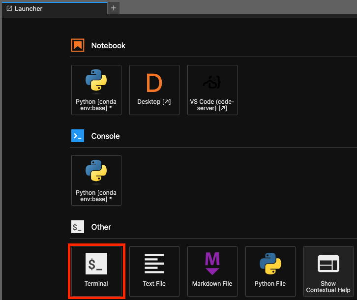
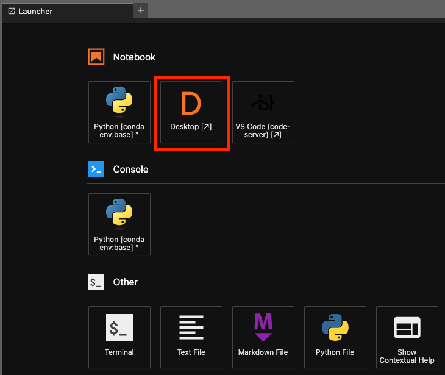
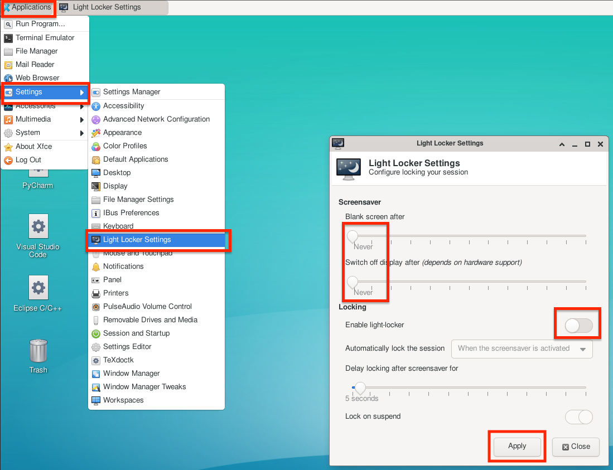
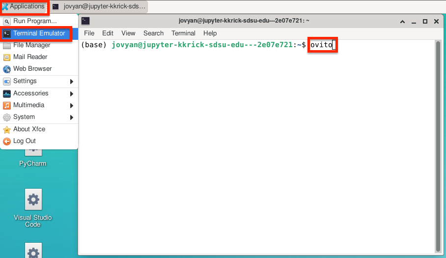
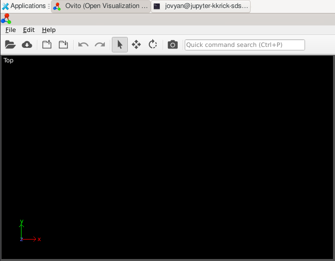

# Molecular Dynamics Notebook

Jupyter Notebook container image for molecular-dynamics and materials-science workflows.

## Software included

- CMake, GCC/G++, GFortran, OpenMPI, and Vim
- GROMACS 2026.3 with CUDA support
- LAMMPS
- Quantum ESPRESSO 7.5
- OVITO
- Jupyter Desktop

This image is based upon the [Jupyter Stack SciPy image](https://github.com/jupyter/docker-stacks/tree/main/images/scipy-notebook).

## First-time terminal setup

On the Launcher page, select **Terminal** in the **Other** section to open a terminal.



The first time you use an MD Notebook, copy the shell startup files supplied by the image into your home directory, then load them into the current terminal. Run these commands once:

```bash
cp /etc/skel/.bashrc ~/.bashrc
cp /etc/skel/.profile ~/.profile
source ~/.bashrc
source ~/.profile
```

## GROMACS

GROMACS requires its environment setup script. Add it to your Bash startup file once, then reload the file:

```bash
echo 'source /usr/local/gromacs/bin/GMXRC' >> ~/.bashrc
source ~/.bashrc
```

You can then run GROMACS commands, for example:

```bash
gmx --version
```

New terminal sessions load this configuration automatically.

## LAMMPS

Run LAMMPS with the `lmp` command:

```bash
lmp -h
```

Example input files are available under `/opt/lammps/examples`:

```bash
cd /opt/lammps/examples
find . -name 'in.*' | head
lmp -in <input-file>
```

## Quantum ESPRESSO

Quantum ESPRESSO executables, including `pw.x`, are already on `PATH`. Confirm the installation with:

```bash
pw.x -version
```

The Quantum ESPRESSO tree is located at `/opt/qe-7.5`. To explore an example:

```bash
cd /opt/qe-7.5/
find . -name '*.in' | head
pw.x -in <example-input-file>
```

## Desktop and display settings

From the Jupyter Launcher, select **Desktop** to open the graphical desktop.



To keep the desktop session awake, open **Applications** → **Settings** → **Light Locker Settings**. Set both **Blank screen after** and **Switch off display after** to **Never**, turn off **Enable light-locker**, and select **Apply**.



## Running OVITO on the desktop

In the graphical desktop, open **Applications** → **Terminal Emulator**. At the terminal prompt, run:

```bash
ovito
```



OVITO opens as a separate desktop application window. Use its **File** menu or the open-folder icon to load your data.


