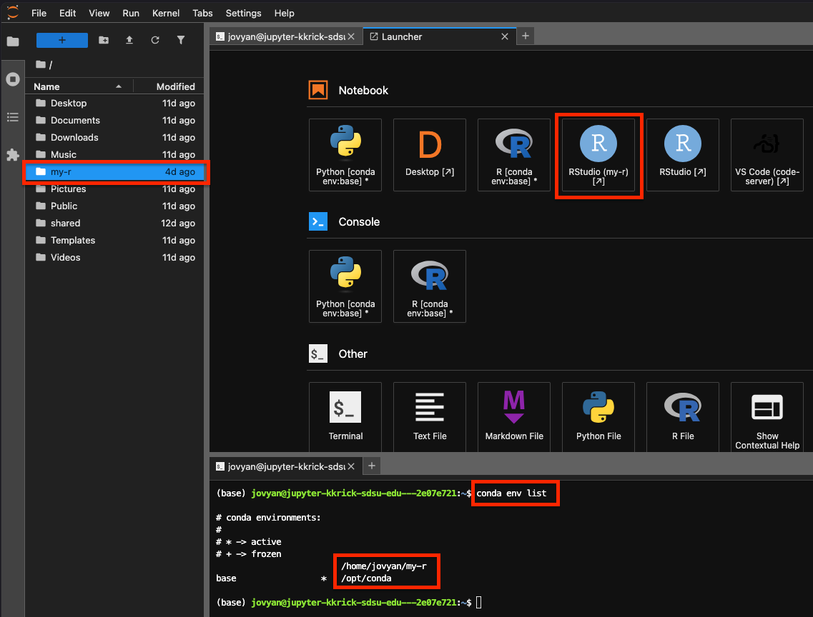
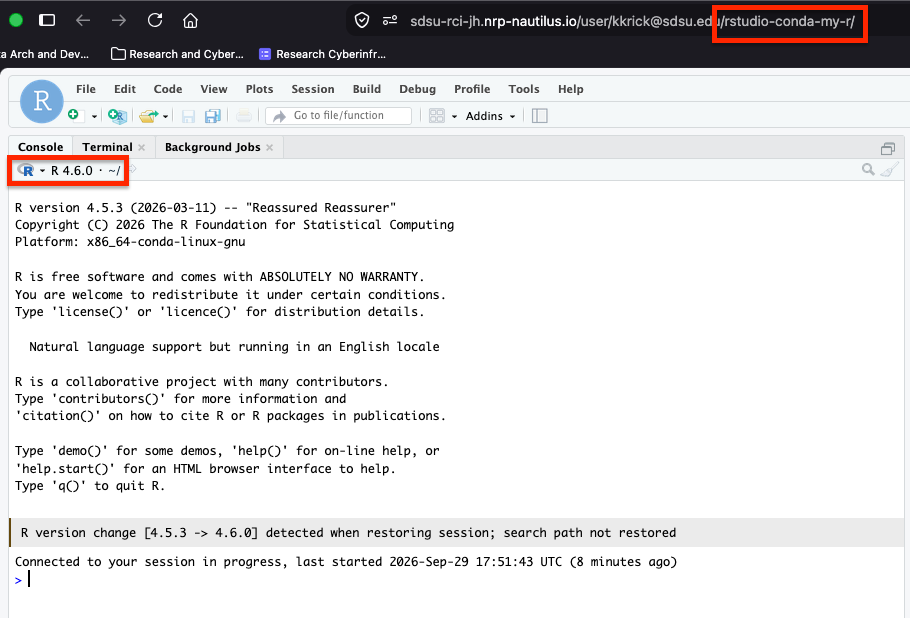

# RStudio Desktop Notebook
A container image for a Jupyter Notebook with RStudio and a desktop environment

## Software Inluded
- RStudio (Server and Desktop)
- Jupyter Desktop

## Custom conda R environments
At Jupyter startup the image scans conda environments and registers a separate
RStudio launcher tile (via [jupyter-rsession-proxy](https://github.com/jupyterhub/jupyter-rsession-proxy))
for every environment that contains an executable `bin/R`. Each RStudio session is
started inside `conda activate <env>`, so the environment's `PATH`, `activate.d`
hooks, and libraries are applied.

- The conda **base** environment is intentionally skipped; RStudio running with the
  image's default R is provided by the stock `rstudio` tile registered by
  jupyter-rsession-proxy.
- Environments created after Jupyter starts appear the next time the Jupyter server
  is restarted.
- Additional search roots can be supplied with the colon-separated
  `JUPYTER_RSESSION_PROXY_ENV_DIRS` environment variable (prefix environments such as
  `conda create -p ~/my-r-env ...` under `$HOME` are also detected).
  By default, the following paths will be searched for conda environments containing R:
  - `/home/jovyan`
  - `/home/jovyan/.conda`
  - `/home/jovyan/envs`

## Using a custom version of R

These steps show how to run RStudio Desktop with your own R (for example `r-base=4.6.0`)
installed into a persistent conda environment under `$HOME`.

### 1. Check the latest R version supported by the installed RStudio

RStudio is built against a specific range of R releases, so start a Jupyter terminal
(`Launcher` -> `Terminal`) and note the RStudio version in this image:

```bash
rstudio-server version
# 2026.07.1+147 (Pacific Dogwood) for Ubuntu Jammy
```

RStudio records the minimum and maximum R versions for that build in
`cmake/globals.cmake` of the matching source tag, which you can query directly:

```bash
RS=$(rstudio-server version | awk '{print $1}')
curl -sL "https://raw.githubusercontent.com/rstudio/rstudio/v${RS/+/%2B}/cmake/globals.cmake" \
  | grep -E 'set\(RSTUDIO_R_VERSION_(REQUIRED|MAXIMUM) '
# set(RSTUDIO_R_VERSION_REQUIRED "3.6.0")
# set(RSTUDIO_R_VERSION_MAXIMUM "4.6.0")
```

Choose an `r-base` version between those two bounds. An R newer than the maximum still
starts -- RStudio logs a warning and may disable the Plots pane -- so prefer the highest
version at or below `RSTUDIO_R_VERSION_MAXIMUM`. The Plots pane additionally requires an
R whose graphics engine is at or below the ceiling RStudio was tested with:

```bash
/usr/lib/rstudio-server/bin/rsession --help 2>&1 | grep -m1 r-compatible-graphics-engine-version
#   --r-compatible-graphics-engine-version arg (=17)
```

RStudio Desktop is the same build as RStudio Server here; check it with
`cat /usr/lib/rstudio/resources/app/VERSION` (the `rstudio` CLI cannot print a version in
the container because Electron needs a display and sandbox).

New R support is announced in the [RStudio release notes](https://docs.posit.co/ide/news/)
-- for example RStudio `2026.04.0 "Globemaster Allium"` added "Support for the upcoming
R 4.6.0 release", so the `2026.07.1` build in this image supports R 4.6.x.

### 2. Create a conda environment with that R version

See the [TIDE environment management guide](https://csu-tide.github.io/jupyterhub/environment-management)
for general conda/mamba usage. The detail that matters here is `--prefix`: an environment
created by name lands in `/opt/conda`, which is reset every time the notebook restarts, so
create it under your persistent home directory instead. Keep environments off shared
storage, and watch your [disk quota](https://csu-tide.github.io/jupyterhub/faqs/diskquota).

The prefix's directory name becomes the launcher tile label, so `--prefix ~/my-r` yields
an `RStudio (my-r)` tile:

```bash
conda create -y --prefix ~/my-r --channel conda-forge r-base=4.6.0
```

Confirm the environment is on `$HOME` and not `/opt/conda`:

```bash
conda env list
# /home/jovyan/my-r
# base  *  /opt/conda
```

### 3. Shut down the notebook

Launcher tiles are registered when Jupyter starts, so the new environment is not visible
until the server restarts. Stop the notebook following
[Manually Stop Notebook](https://csu-tide.github.io/jupyterhub/faqs/stopnotebook):
`File` -> `Hub Control Panel` -> `Stop My Server`.

### 4. Relaunch the RStudio Desktop Notebook

Start your server again from the hub control panel, selecting the RStudio Desktop Notebook
image. The startup scan now registers a tile for every environment containing an
executable `bin/R`.

### 5. Launch RStudio from the custom environment

On the Jupyter `Launcher`, under **Notebook**, open the `RStudio (<env-name>)` tile --
`RStudio (my-r)` for the environment above. The `?` in the tile label is the app version
reported by the proxy and is expected. The session URL contains the matching proxy path,
`.../rstudio-conda-my-r/`.



### 6. Verify the RStudio session is using your R version

The R selector at the top of the Console pane and the startup banner both report the
version, or run:

```r
R.version.string
# [1] "R version 4.6.0 ..."
```

When an earlier session is restored with the new environment, the console notes the
switch, e.g. `R version change [4.5.3 -> 4.6.0] detected when restoring session`.



This image is based on the [Jupyter Docker Stacks R Notebook](https://github.com/jupyter/docker-stacks/tree/main/images/r-notebook) container image.
